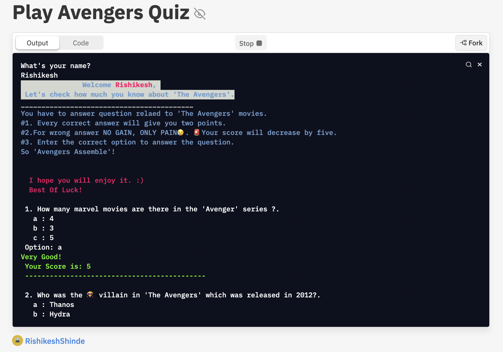

# **Avenger Movies Quiz**
Avengers movie quiz game build with javascript CLI.

>### What is this 'Avenger Movies Quiz'?
This is a javascript Command-Line-Interface quiz based on marvel's 'The Avenger' movie series. It uses a Javascript console to show the output.

>### What are the special things in this code that one should know?
Here are some special things that I would like to tell about app:

1. Javascript array of objects is used to store quiz questions and answers.
2. npm readline-sync is used to take input from user.
3. npm chalk is used to do some designing on CLI.
4. Javascript Math.random is used to output random messages.
5. Infinite loop concept.

and that's it.

>### Where do I can have a fun of this CLI app?
The quiz is written using [replit.com](https://replit.com)

[You can enjoy the gameplay here.](https://replit.com/@RishikeshShinde/Play-Avengers-Quiz#index.js?embed=1&output=1"LCO")

I hope you would like it.

Enjoy!